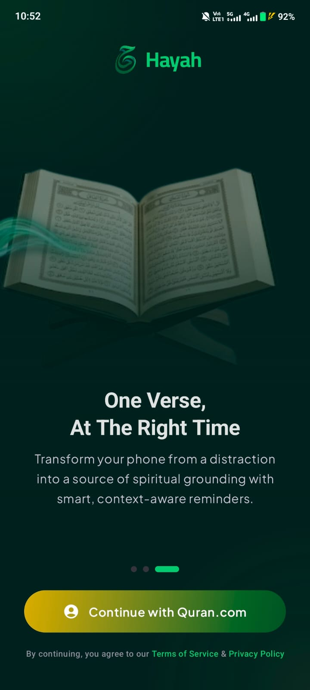
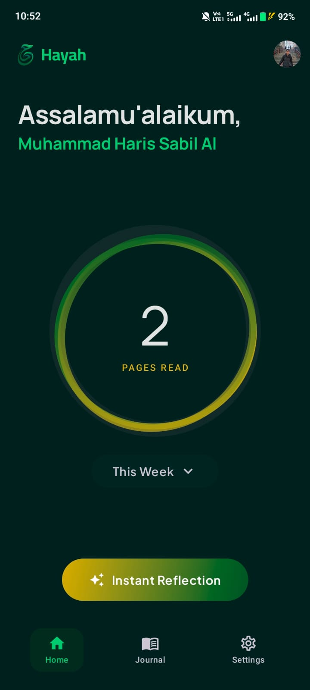
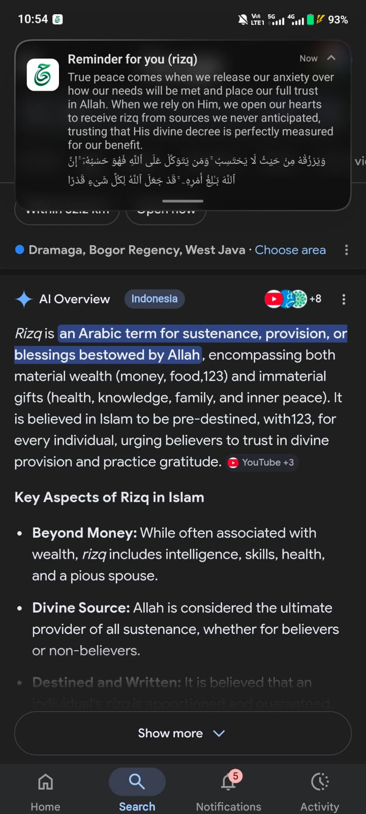
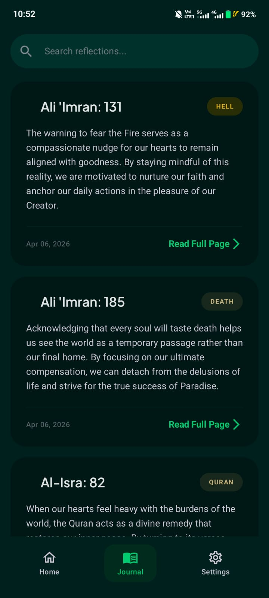
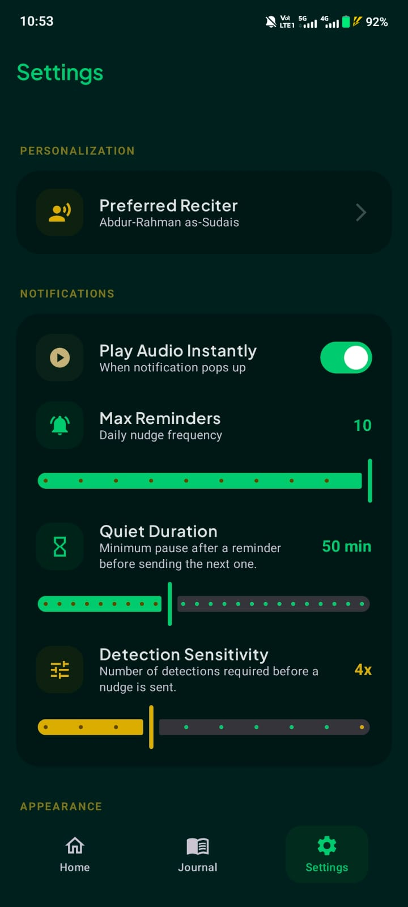

# Hayah

Hayah (Arabic for "life") is an Android app that delivers context-aware Quranic reminders by detecting user activities and on-screen content. It combines activity recognition, accessibility services, and Firebase AI to surface relevant verses with personalized reflections.

## Screenshots

<table>
   <tr>
    <td align="center">Onboarding</td>
    <td align="center">Home</td>
    <td align="center">Detection Notification</td>
  </tr>
  <tr>
    <td></td>
    <td></td>
    <td></td>
  </tr>
  <tr>
    <td align="center">Journal</td>
    <td align="center">Reading</td>
    <td align="center">Settings</td>
  </tr>
  <tr>
    <td></td>
    <td></td>
    <td></td>
  </tr>
</table>

## Features

- **Context-Aware Reminders**: Detects keywords from notifications and screen content via accessibility service, delivers relevant Quranic verses
- **Activity Recognition**: Responds to physical activities (walking, driving, etc.) with appropriate spiritual reminders
- **AI-Powered Reflections**: Uses Firebase AI Logic (Gemini) to generate short reflections grounded in verse text
- **Quran Reader**: Full-page reading with Uthmani Arabic and English translation, tracks reading progress
- **Journal**: History of all reminders with verse details, reflections, and audio playback
- **Quran.com Integration**: OAuth authentication, verse fetching, audio recitations, activity reporting

## Getting Started

### Prerequisites

1. **Quran.com API Access**
   - Register an OAuth 2.0 application at [Quran.com](https://quran.com) to obtain `client_id` and `client_secret`
   - You will receive credentials for both test (prelive) and production environments
   - Register `id.harissabil.hayah://callback` as the redirect URI

2. **Cloudflare Workers Account**
   - The app uses a Cloudflare Worker as an OAuth token proxy to keep `client_secret` off-device
   - Requires [Cloudflare account](https://dash.cloudflare.com/sign-up) and [Wrangler CLI](https://developers.cloudflare.com/workers/wrangler/install-and-update/)

3. **Firebase Project**
   - Create a project at [Firebase Console](https://console.firebase.google.com)
   - Enable Firebase AI Logic and connect it to a Gemini model

### Installation & Setup

1. **Deploy the OAuth Proxy Worker**
   
   Edit [`worker/src/index.js`](worker/src/index.js) and replace the placeholder credentials in `CLIENT_CONFIG`:
   ```javascript
   const CLIENT_CONFIG = {
     "YOUR_TEST_CLIENT_ID": {
       secret: "YOUR_TEST_CLIENT_SECRET",
       // ...
     },
     "YOUR_PROD_CLIENT_ID": {
       secret: "YOUR_PROD_CLIENT_SECRET",
       // ...
     },
   };
   ```
   
   Deploy to Cloudflare:
   ```bash
   cd worker
   npx wrangler deploy
   ```
   
   Note the deployed worker URL (e.g., `https://qurancom-oauth.<your-subdomain>.workers.dev`).

2. **Configure Firebase**
   
   - Download `google-services.json` from Firebase Console
   - Place it in `app/google-services.json`
   - Ensure Firebase AI Logic is enabled with Gemini model access

3. **Configure Local Properties**
   
   Copy `local.properties.example` to `local.properties` and fill in your values:
   ```properties
   HAYAH_USE_PRODUCTION=true
   HAYAH_CLIENT_ID_PROD=your-prod-client-id
   HAYAH_CLIENT_ID_TEST=your-test-client-id
   HAYAH_AUTH_ENDPOINT_PROD=https://oauth2.quran.foundation/oauth2/auth
   HAYAH_AUTH_ENDPOINT_TEST=https://prelive-oauth2.quran.foundation/oauth2/auth
   HAYAH_TOKEN_PROXY_URL=https://your-worker-domain/token
   HAYAH_REVOKE_PROXY_URL=https://your-worker-domain/revoke
   HAYAH_API_BASE_PROD=https://apis.quran.foundation/
   HAYAH_API_BASE_TEST=https://apis-prelive.quran.foundation/
   HAYAH_REDIRECT_URI=id.harissabil.hayah://callback
   ```

4. **Build and Run**
   ```bash
   ./gradlew assembleDebug
   ```
   Or open in Android Studio and run on device/emulator.

### Runtime Permissions

The app requires these permissions at runtime:

- **Notification Access** (Android 13+): For posting reminder notifications
- **Activity Recognition**: For detecting physical activities
- **Accessibility Service**: For scanning on-screen content (enable in Settings > Accessibility)

## Architecture

| Layer | Technology |
|-------|------------|
| UI | Jetpack Compose, Material 3 |
| Architecture | MVVM |
| DI | Koin |
| Networking | Retrofit, OkHttp |
| Persistence | Room, DataStore |
| Auth | AppAuth (OAuth 2.0 + PKCE) |
| AI | Firebase AI Logic (Gemini) |

## License

See [LICENSE](LICENSE) for details.
