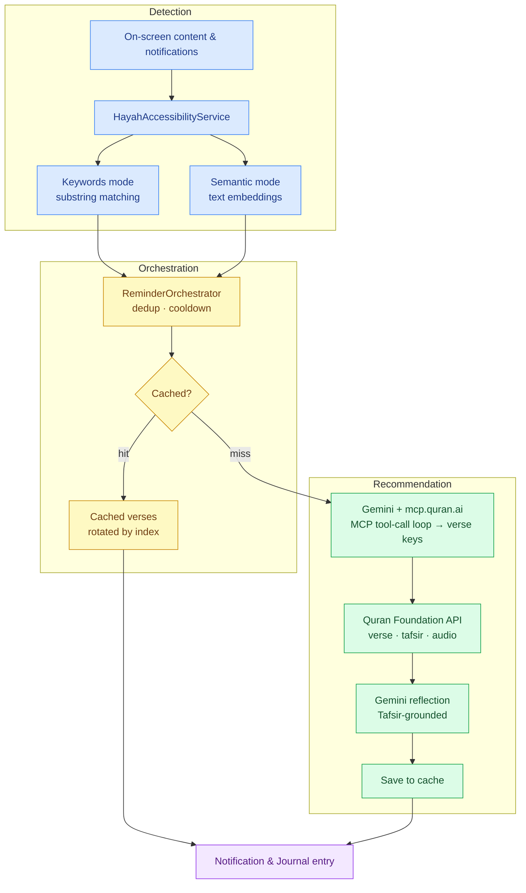

# Hayah

[](https://play.google.com/store/apps/details?id=id.harissabil.hayah)
[](https://www.youtube.com/watch?v=TUdVwVYl3Fk)

The modern world is loud and overwhelming. For busy Muslims, finding the right moment to connect with the Quran can be a challenge, not because the intention isn't there, but because life keeps moving. Hayah exists to keep that connection alive, no matter how busy life gets.

Hayah (Arabic for "life") is an Android app that delivers context-aware Quranic reminders by detecting user activities and on-screen content. It combines activity recognition, accessibility services, and Firebase AI to surface relevant verses with personalized reflections.

## Table of Contents

- [Screenshots](#screenshots)
- [Features](#features)
- [How It Works](#how-it-works)
- [Getting Started](#getting-started)
- [Architecture](#architecture)
- [Roadmap](#roadmap)
- [License](#license)

## Screenshots

<table>
  <tr align="center">
    <td width="33%"><b>Onboarding</b></td>
    <td width="33%"><b>Home</b></td>
    <td width="33%"><b>Notification</b></td>
  </tr>
  <tr>
    <td></td>
    <td></td>
    <td></td>
  </tr>
  <tr align="center">
    <td><b>Journal</b></td>
    <td><b>Reading</b></td>
    <td><b>Settings</b></td>
  </tr>
  <tr>
    <td></td>
    <td></td>
    <td></td>
  </tr>
</table>

## Features

- **Context-Aware Reminders**: Scans notifications and on-screen content via accessibility service, delivers relevant Quranic verses
  - **Keywords mode**: fast, exact substring matching against a predefined keyword list
  - **Semantic mode**: on-device text embeddings that detect topics by meaning, no exact match needed
- **Activity Recognition**: Responds to physical activities (walking, driving, etc.) with appropriate spiritual reminders
- **MCP-Grounded Verse Recommendations**: Connects to [mcp.quran.ai](https://mcp.quran.ai) via Model Context Protocol so Gemini retrieves real verses through tool calls to reduce hallucinated references
- **AI-Powered Reflections**: Uses Firebase AI Logic (Gemini) to generate short reflections grounded in verse translation and Ibn Kathir tafsir
- **Quran Reader**: Full-page reading with Uthmani Arabic and English translation, tracks reading progress
- **Journal**: History of all reminders with verse details, reflections, and audio playback
- **Quran.com Integration**: OAuth authentication, verse fetching, audio recitations, activity reporting

## How It Works

The reminder pipeline has two stages: detecting a relevant context on the device, then fetching and generating the right verse for it.



## Getting Started

### Prerequisites

1. **Quran.com API Access**
   - Register an OAuth 2.0 application at [Quran.com](https://quran.com) to obtain `client_id` and `client_secret`
   - You will receive credentials for both test (prelive) and production environments
   - Register `id.harissabil.hayah://callback` as the redirect URI

2. **Cloudflare Workers Account**
   - The app uses a Cloudflare Worker as an OAuth token proxy to keep `client_secret` off-device
   - Requires [Cloudflare account](https://dash.cloudflare.com/sign-up) and [Wrangler CLI](https://developers.cloudflare.com/workers/wrangler/install-and-update/)

3. **Firebase Project**
   - Create a project at [Firebase Console](https://console.firebase.google.com)
   - Enable Firebase AI Logic and connect it to a Gemini model

### Installation & Setup

1. **Deploy the OAuth Proxy Worker**
   
   Edit [`worker/src/index.js`](worker/src/index.js) and replace the placeholder credentials in `CLIENT_CONFIG`:
   ```javascript
   const CLIENT_CONFIG = {
     "YOUR_TEST_CLIENT_ID": {
       secret: "YOUR_TEST_CLIENT_SECRET",
       // ...
     },
     "YOUR_PROD_CLIENT_ID": {
       secret: "YOUR_PROD_CLIENT_SECRET",
       // ...
     },
   };
   ```
   
   Deploy to Cloudflare:
   ```bash
   cd worker
   npx wrangler deploy
   ```
   
   Note the deployed worker URL (e.g., `https://qurancom-oauth.<your-subdomain>.workers.dev`).

2. **Configure Firebase**
   
   - Download `google-services.json` from Firebase Console
   - Place it in `app/google-services.json`
   - Ensure Firebase AI Logic is enabled with Gemini model access

3. **Configure Local Properties**
   
   Copy `local.properties.example` to `local.properties` and fill in your values:
   ```properties
   HAYAH_USE_PRODUCTION=true
   HAYAH_CLIENT_ID_PROD=your-prod-client-id
   HAYAH_CLIENT_ID_TEST=your-test-client-id
   HAYAH_AUTH_ENDPOINT_PROD=https://oauth2.quran.foundation/oauth2/auth
   HAYAH_AUTH_ENDPOINT_TEST=https://prelive-oauth2.quran.foundation/oauth2/auth
   HAYAH_TOKEN_PROXY_URL=https://your-worker-domain/token
   HAYAH_REVOKE_PROXY_URL=https://your-worker-domain/revoke
   HAYAH_API_BASE_PROD=https://apis.quran.foundation/
   HAYAH_API_BASE_TEST=https://apis-prelive.quran.foundation/
   HAYAH_REDIRECT_URI=id.harissabil.hayah://callback
   HAYAH_MCP_QURAN_URL=https://mcp.quran.ai
   ```

4. **Build and Run**
   ```bash
   ./gradlew assembleDebug
   ```
   Or open in Android Studio and run on device/emulator.

### Runtime Permissions

The app requires these permissions at runtime:

- **Notification Access** (Android 13+): For posting reminder notifications
- **Activity Recognition**: For detecting physical activities
- **Accessibility Service**: For scanning on-screen content (enable in Settings > Accessibility)

## Architecture

| Layer | Technology                                              |
|-------|---------------------------------------------------------|
| UI | Jetpack Compose, Material 3                             |
| Architecture | MVVM                                                    |
| DI | Koin                                                    |
| Networking | Retrofit, OkHttp                                        |
| Persistence | Room, DataStore                                         |
| Auth | AppAuth (OAuth 2.0 + PKCE)                              |
| AI | Firebase AI Logic (Gemini), MediaPipe Tasks (text embeddings) |
| MCP Client | [MCP Kotlin SDK](https://github.com/modelcontextprotocol/kotlin-sdk) |

## Roadmap

- Add Gemini Nano as a second-pass filter to reduce false positives on supported devices

## License

See [LICENSE](LICENSE) for details.
